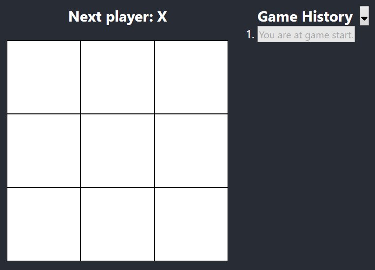
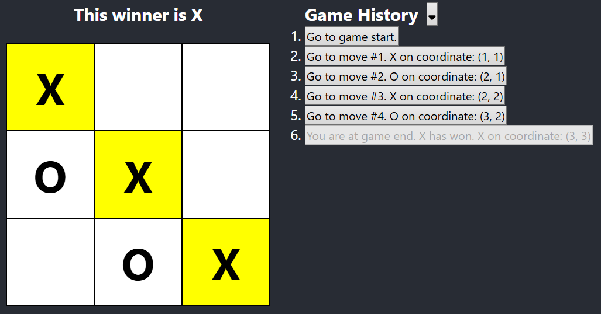

# This project followed React's Tic Tac Toe Tutorial 

The tutorial used for this project can be accessed through React's [Official Website](https://react.dev).\
Specifically the [Tic Tac Toe Tutorial](https://react.dev/learn/tutorial-tic-tac-toe) found under the Get Started section of the website.

The application is hosted on GitHub Pages and can be accessed here: .

## What have I Achieved and Learnt through this Project

Doing this simple project allowed me gain a firm understanding on the basic React concepts whilst producing a functional application for me to play around with.\
I wish to work on more complex React projects with React frameworks to further my understanding in React development.

## Features of the Completed Tic Tac Toe Application

1. State Management.
2. Interactive Game Board with playable Tic Tac Toe.
3. Turn History and Time Travel.
4. Completed all 5 suggested improvements to the application under the [Wrapping Up](https://react.dev/learn/tutorial-tic-tac-toe#wrapping-up) section.

## Screenshots of the Completed Application

  <h3>Start of Game</h3>
  <h3>End of Game</h3>
  
  

